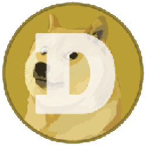

<p align="center">
  
</p>

# dogecoin but on robinhood

Static site for a community build: operate a Robinhood Chain full node and put Dogecoin on it. Unofficial — not affiliated with Robinhood.

**Live:** https://dogecoinhood.com  
**Repo:** https://github.com/0xiglo/dogecoin-on-robinhood  
**X:** https://x.com/DogeCoinHood_

## Stack

Plain HTML, CSS, vanilla JS. No build step. Vercel static deploy.

## Pages

| Page | File |
|------|------|
| Overview | `index.html` |
| Docs (node deep-dive) | `docs.html` |
| Explorer ($0 fees / rhDOGE rewards) | `explorer.html` |
| Vision | `vision.html` |
| Token | `token.html` |
| FAQ | `faq.html` |

`fees.html` redirects to the Explorer.

## Run locally

```bash
python -m http.server 8000
```

## Deploy

```bash
npx vercel deploy --prod
```

## References

- https://docs.robinhood.com/chain/run-a-full-node
- https://x.com/vladtenev/status/1514684182718398487
